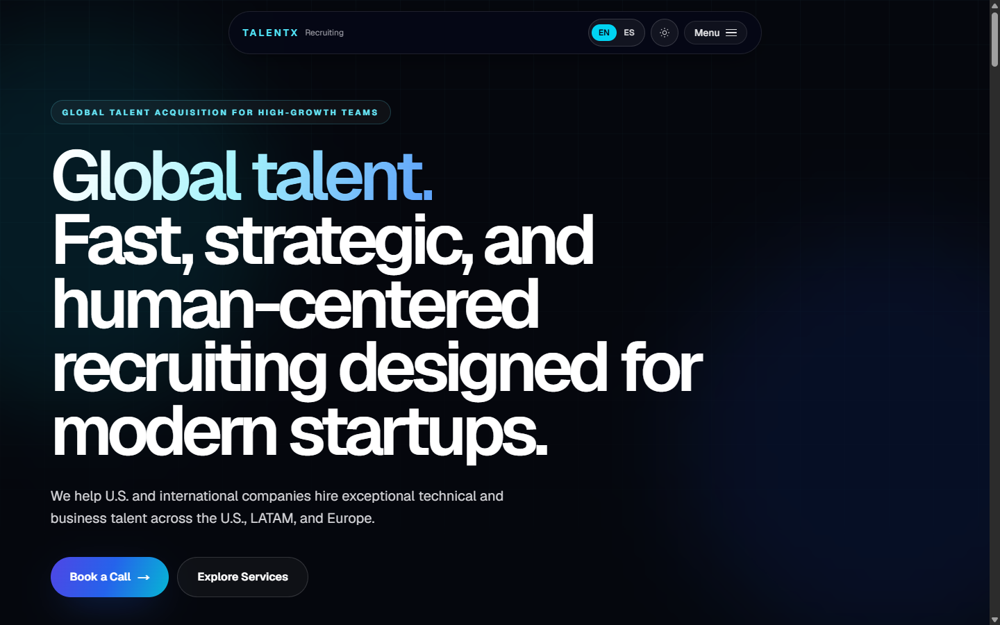

# TalentX Recruiting

<p align="center">
  <strong>A bilingual recruiting website and product portfolio for high-growth teams.</strong><br />
  Built to communicate TalentX's services, people, and working style through a fast, responsive, motion-led experience.
</p>

<p align="center">
  <a href="https://talentxrecruiting.com"><strong>Visit the live website</strong></a>
  ·
  <a href="#local-development">Run locally</a>
  ·
  <a href="#content-map">Edit content</a>
</p>

<p align="center">
  
  
  
  
</p>



## Experience highlights

- English and Spanish content with a client-side locale switcher
- Single light palette — cool gray canvas with a navy brand accent, no theme switch
- Motion-based section reveals, scroll progress, and reduced-motion support
- Interactive globe built with Cobe
- Scroll-driven portfolio route where the backdrop advances as you scroll, with a
  lighter looping fallback for touch and reduced-motion visitors
- Service, process, team, and contact sections designed for a single-page conversion flow
- Open Graph and Twitter metadata for social sharing

## Routes

| Route | Purpose |
| --- | --- |
| `/` | TalentX service overview, process, proof points, team, and contact calls to action. |
| `/meet-the-team/vicente-barrientos` | Vicente's product portfolio, as a scroll-driven journey. |
| `/meet-the-team/benjamin-mahave` | Permanent redirect to Vicente's page. |
| `/resumex` | Redirect to the ResumeX app. |

## Stack

- Next.js 16 App Router and React 19
- TypeScript and Tailwind CSS 4
- Motion for interaction, scroll linking, and transition primitives
- Cobe for the interactive globe
- Custom locale synchronization (`lib/locale-sync.ts`); the outbound `?theme=`
  contract in `lib/theme-sync.ts` is kept for ResumeX links only

## Local development

```bash
git clone https://github.com/VicenteBarrientos/talentx-website.git
cd talentx-website
npm install
npm run dev
```

Open <http://localhost:3000>.

Optional public URL overrides:

```env
NEXT_PUBLIC_TALENTX_URL="http://localhost:3000"
NEXT_PUBLIC_RESUMEX_URL="https://resumex.talentxrecruiting.com"
```

## Content map

| Location | What to edit |
| --- | --- |
| `lib/i18n/talentx.ts` | English and Spanish marketing copy. |
| `components/TalentXHome.tsx` | Main website composition and section order. |
| `components/VicentePortfolioPage.tsx` | Portfolio journey: project list, scroll wiring, and media fallbacks. |
| `components/PartnerProfilePage.tsx` | Shared partner-profile layout. |
| `lib/site-urls.ts` | Canonical TalentX and ResumeX links. |
| `public/videos/` | Portfolio backdrop: `*-traversal.mp4` (scrubbed) and `*-world.mp4` (loop). |
| `public/` | Partner images and social artwork. |

See [`AGENT_HANDOFF.md`](./AGENT_HANDOFF.md) for current state and open work.

Project statuses, affiliations, contact details, and external URLs are maintained as content in the repository. Review them before each deployment so the public portfolio remains current.

## Commands

| Command | Purpose |
| --- | --- |
| `npm run dev` | Start the development server. |
| `npm run lint` | Run ESLint. |
| `npm run build` | Create the production build. |
| `npm run start` | Serve a completed production build. |

## Deployment

The production site is available at [talentxrecruiting.com](https://talentxrecruiting.com). For another deployment, configure the two public URL variables above so metadata and cross-site navigation point to the intended domains.

## Related project

[ResumeX](https://github.com/VicenteBarrientos/ResumeX) is the companion job-search workspace linked from the TalentX ecosystem.
